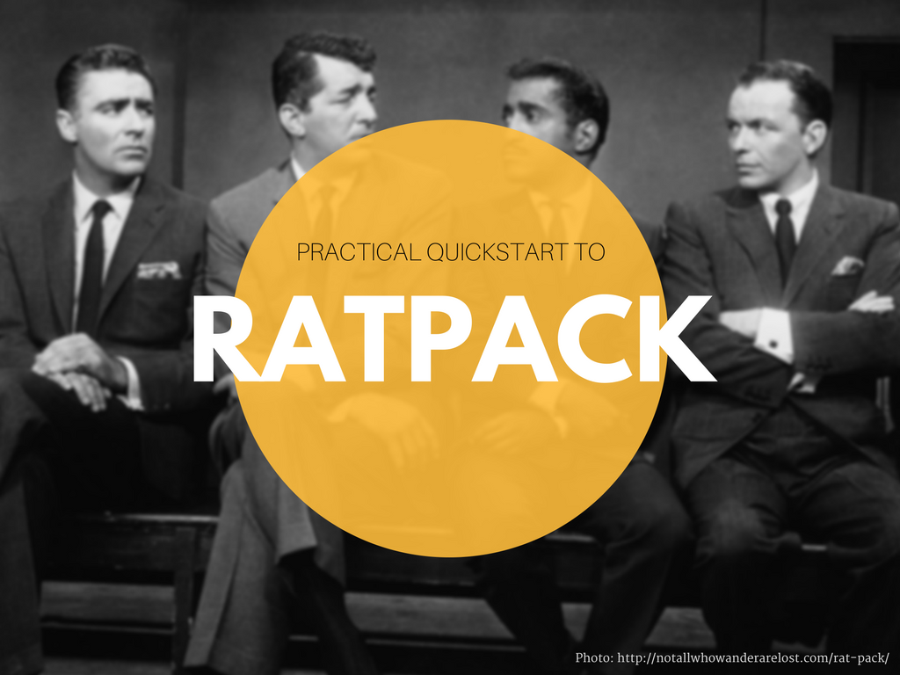
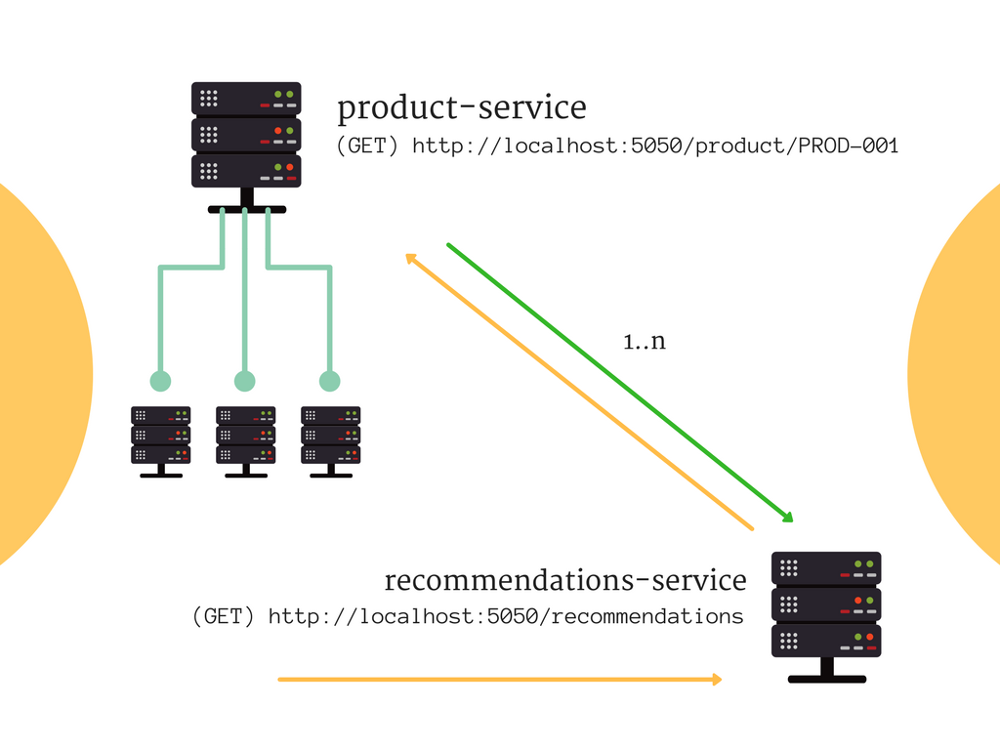

ratpack-quickstart-demo
-----------------------------



*Photo: http://notallwhowanderarelost.com/rat-pack/*

Hello and welcome to the repository containing source code from my **Practical quickstart to Ratpack** talk. 


## Application architecture

This demo simulates following problem. Imagine two microservices - *product-service* and *recommendations-service*. 

The first one is just a simple REST service that allows you to read information about given product. But this application does not simply
translate HTTP request to some SQL query for example. It communicates with other services, databases or even file system instead.
It means that receiving a product information will take some time, because some information might be taken from multiple 
web services while some of them might be loaded from the database. We will simulate latencies in this case (from 100 ms to 1500 ms).

*recommendation-service* is smart enough to suggest recommendations to the client, but it doesn't know anything about the products.
It retrieves product information from *product-service* via HTTP GET request. We won't focus on creating recommendations engine, 
we will hardcode products IDs and we will focus only on communication between both services. 



## Exemplary requests

Below you can find exemplary requests triggered with [HTTPie](https://httpie.org/) command line tool.

```bash
http localhost:5050/product/PROD-001
```

```bash
HTTP/1.1 200 OK
content-encoding: gzip
content-type: application/json
transfer-encoding: chunked

{
    "id": "PROD-001",
    "name": "Learning Ratpack",
    "price": 29.99
}
```

```bash
http localhost:5050/product/PROD-006
```

```bash
HTTP/1.1 404 Not Found
content-encoding: gzip
content-type: application/json
transfer-encoding: chunked

{
    "message": "Product not found"
}
```

```bash
http localhost:5050/recommendations 
```

```bash 
HTTP/1.1 200 OK
content-encoding: gzip
content-type: application/json
transfer-encoding: chunked

{
    "discount": "-20%",
    "products": [
        {
            "id": "PROD-001",
            "name": "Learning Ratpack",
            "price": 23.992
        },
        {
            "id": "PROD-002",
            "name": "Netty In Action",
            "price": 31.992
        }
    ],
    "total": 2
}
```